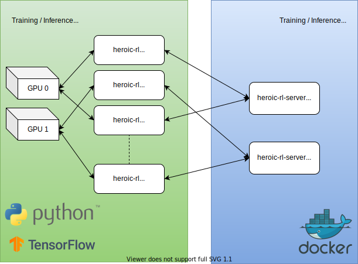

# Heroic RL: Deep RL Agent for a Real-Time Strategy Game


Code for the paper [Deep RL Agent for a Real-Time Strategy
Game](https://arxiv.org/abs/2002.06290) by Michał Warchalski, Dimitrije
Radojević, and Miloš Milošević.

## Summary

This is the codebase that was used to train and evaluate reinforcement learning
agents that can play [Heroic - Magic Duel](https://www.heroicgame.com/), a
real-time strategy player-versus-player mobile game.

## Architecture



There are two components to the system:
1. **Training/inference agent**, which contains policy/value network, training
   configuration, Gym environment etc. This repository contains agent codebase.
2. **Training/inference server**, which applies agent's actions to battle, and
   returns observed battle state. This component is provided as a Docker image.

Agents communicate with servers via HTTP. Server exposes a RESTful API for
starting new battles, stepping battles, fetching replay etc. Observations and
actions are exchanged in JSON format.

Heroic environment, including serialization and communication with server, is
wrapped in a [Gym](https://gym.openai.com/) environment on the agent side.

MLP policy and value network architecture is implemented in Tensorflow v1.
Experimental RNN policy is also available. An implementation of
[PPO](https://arxiv.org/abs/1707.06347), inspired by [OpenAI
baselines](https://github.com/openai/baselines) and
[stable-baselines](https://github.com/hill-a/stable-baselines), is used. More
details in the paper.

Agents can be trained with several training plans, against several kinds of
adversaries of varying difficulty, e.g. classical AI bots that are provided
with the server, or via selfplay, and can use several predefined reward
functions. Training is highly configurable, and can be resumed if interrupted.

GPUs are used for rollouts and update steps, if available. MPI is used as
backend for distributed Adam optimizers for policy and value functions, and for
syncing TF variables after update step across subprocesses.

Agents can be run in inference mode, which is used for evaluation. There is
also limited battle rendering capability, in form of terminal-based UI.

## Setting Up

### Server

Run an instance of training/inference server with:
```bash
docker run -it -d quay.io/nordeus/heroic-rl-server:latest
```

Multiple instances can be spun up, which can make rollouts faster. When
specifying multiple servers for agents to connect to, each agent subprocess
will be assigned a single server instance.

In order to access this server from host machine, in case of running the agent from
the source, container port that server is listening on should be mapped to a port
on the host machine with `-p <host_port>:8081`.

### Agent

There are two ways to run the agent, as Docker container or directly from
source.

#### With Docker

Main agent script, `heroic-rl`, can be run containerized with:
```bash
docker run -it --gpus all quay.io/nordeus/heroic-rl-agent
```

It is recommended to create a separate Docker network for communication between
agent and server:
```bash
docker network create heroic-rl
```

This network can be specified in Docker run command for both agent and server
by adding `--network heroic-rl` to command options.

If running for training, it is also recommended to mount a `data` directory,
which is used to store experiment logs, config and checkpoints, by appending
`-v $PWD/data:/app/data` to Docker `run` command. This will mount `data` dir in
current working dir on the host machine to `/app/data` dir within the container.
As a result, all files will be written to the host directory.

Arguments can be passed to `heroic-rl` script either as environment variables or
by directly appending them to Docker run command from above. Environment
variables are named like this: `HEROIC_RL_<COMMAND>_<OPTION>`, and are provided
to run command with `-e <ENVVAR>=<VALUE>`, e.g. `-e HEROIC_RL_TRAIN_EPOCHS=1000`.

#### From source

**Python 3.6.1 or greater is required** to run this project. GNU C compiler and
a few more things are also needed - assuming Ubuntu 18.04, these can be
installed by running:
```bash
sudo apt-get install python3-venv python3-setuptools python3-dev gcc libopenmpi-dev
```

This project uses [Poetry](https://github.com/python-poetry/poetry) for
dependency management and as build tool. To install Poetry for current user,
run:
```bash
curl -sSL https://raw.githubusercontent.com/python-poetry/poetry/master/get-poetry.py | python3
```

In that same shell run `source $HOME/.poetry/env`, or just open up a new shell.

After cloning the repository, run this from within project root:
```bash
poetry install
```

Poetry will create a new virtualenv, and install required dependencies and helper
scripts. In case CUDA-supported GPU(s) is available, please append `-E gpu` to
the end of previous command. Otherwise, Tensorflow will be installed without
GPU support.

**Note:** if there is an issue with pip unable to find `tensorflow`, please run the
following to upgrade pip to latest version - this will only affect pip within
virtualenv that Poetry automatically creates:
```bash
poetry run pip install -U pip
```

Agent entrypoint script can now be invoked by prepending it with `poetry run`:
```bash
poetry run heroic-rl
```

Poetry can spawn a new shell within newly created virtualenv. Within this shell
there is no need to specify `poetry run`:
```bash
poetry shell
heroic-rl
```

Exit the shell with Ctrl-D.

## Running Commands

Agent provides CLI entrypoint called `heroic-rl` that is used to invoke training,
inference and other commands.

Available commands can be listed by running `heroic-rl`, and help for for each
command is displayed by running `heroic-rl <command> --help`. Defaults for each
option are also displayed.

In a nutshell:
- `train` is used for starting a fresh training experiment,
- `resume` resumes an existing experiment, which was interrupted before
  completion,
- `simulate` is used to run inference on specified number of battles with a
  provided agent checkpoint, against specified adversary
- `render` can display actual battle, using provided agent checkpoint as left player,
  in a terminal user interface, based on `curses`
- `serve` starts a Flask service that exposes inference with provided agent
  checkpoint via RESTful API

## Examples

### Training

To train an agent for 1000 epochs against utility-based AI adversary, using
`simple` reward function (+1 for victory, -1 for defeat), running on a training
server listening at `localhost:8081`, and sane defaults for
hyperparameters and other options, run:

```bash
heroic-rl train -e 1000 <exp_name>
```

This will start training in a directory called `data/<exp_name>/<exp_name>_s<seed>`.
Default value for seed is current time, so running multiple experiments with
the same name will result in new subdirectories in `data/<exp_name>`. For
further reference, let's call directory for our example experiment `<exp_dir>`.

You can examine training progress with Tensorboard:
```
tensorboard --logdir <exp_dir>
```

All logs go to `<exp_dir>/train.log`, including training config. Training
config is also serialized as YAML to `<exp_dir>/training_cfg.yml`.

Training progress for each agent in single experiment is tracked separately.
Each agent has a directory called `<exp_dir>/agent_<id>`, let's call it
`<agent_dir>`. There is a tabular representation of training progress called
`progress.txt` in each agent dir, which contains pretty much all data that is
displayed in Tensorboard. Checkpoints for each agent are saved in agent dir, in
[SavedModel](https://www.tensorflow.org/guide/saved_model#the_savedmodel_format_on_disk)
format, each checkpoint having its own directory named after the epoch at which
model was saved, i.e. `simple_save<epoch>`. Checkpoints are created every 10
epochs, by default, which can be changed with `--save-freq`.

### Resuming existing experiment

Training can be interrupted with Ctrl+C at any time. In order to resume an
existing experiment, run:
```bash
heroic-rl resume <exp_dir>
```

### Evaluating performance of trained agent

To simulate 1000 battles against utility-based AI using trained agent checkpoint
saved at epoch 300, running on a training server listening at `localhost:8081`, run:
```bash
heroic-rl simulate -n 1000 <exp_path>/agent_1/simple_save300
```

This will run inference and log final win rate at the end.

### Visualizing battles

To run battle visualization in curses-based TUI, with trained agent checkpoint saved at
epoch 300, running on a training server listening at `localhost:8081`, run:
```bash
heroic-rl render <exp_path>/agent_1/simple_save300
```

There are keyboard shortcuts that can speed up/down replay, reverse time
and simulate another battle. Press `q` to exit the visualization.

## Licensing

### Agent (GPLv3)


Agent source code is published under the terms of [GPL-v3](https://www.gnu.org/licenses/gpl-3.0.html) license. Full license text can be found in [LICENSE.agent.md](./LICENSE.agent.md).

### Server (CC-BY-NC-ND)


Server Docker image is published under the terms of [Creative Commons Attribution-NonCommercial-NoDerivatives 4.0 International License](https://creativecommons.org/licenses/by-nc-nd/4.0/). More details can be found in [LICENSE.server.md](./LICENSE.server.md).

## Citing This Work

```bibtex
@article{warchalski2020heroicrl,
  title={Deep RL Agent for a Real-Time Strategy Game},
  author={Warchalski, Michał and Radojević, Dimitrije and Milošević, Miloš},
  journal={arXiv preprint arXiv:2002.06290},
  year={2020}
}
```
